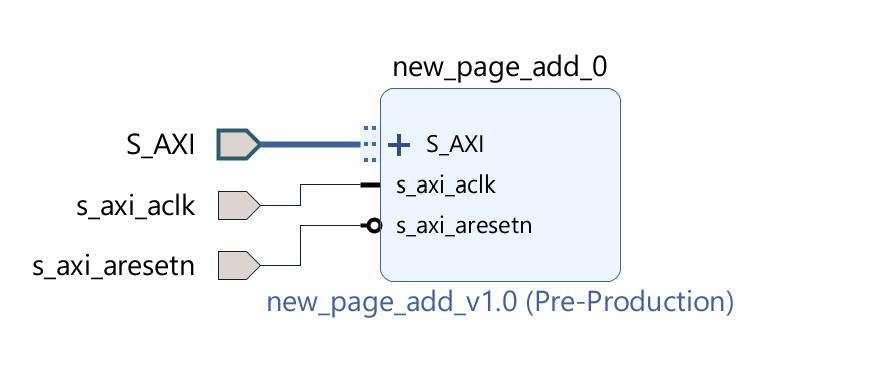
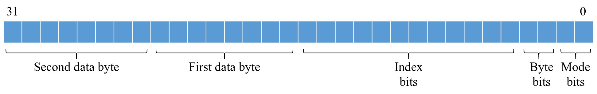
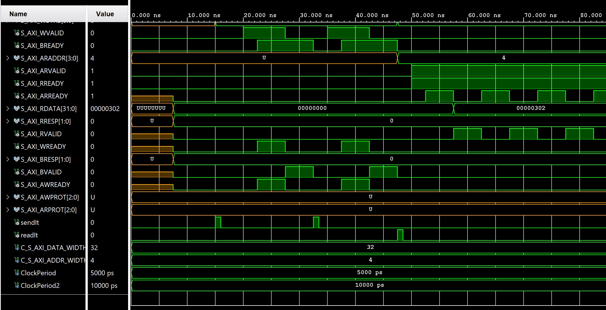

# Page Adder

### Features
- Add 1 to every bytes written to the component

### Component Block Diagram

### Usage

#### Instruction bits
- Bit[1:0] : Mode bits
 - 01 : write 
 - 10 : read
- Bit[3:2]: Byte bits 
 - 00 : one byte 
 - 01 : two bytes 
 - 10 : three bytes
 - 11 : four bytes
- Bit[15:4] : Index bits
- Bit[23:16] : First data byte
- Bit[31:24] : Second data byte

##### Write
- Set the mode bits to 01, number of bytes bits, index of location where the data should be written and data to be written on the instruction bits
- Send the instruction to the first register of the component for one clock cycle to write

##### Read
- Set the mode bits to 10, number of bytes bits, index of location where the data should be read on the instruction bits
- Send the instruction to the first register of the component for one clock cycle
- Access the data by reading the second register of the component at the next clock cycle

### Simulation

